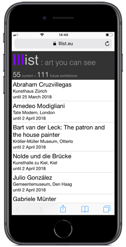

[GitHub](https://github.com/lllisteu/lllisteu-data)

# lllist.eu data

This repository contains data for art exhibitions and art museums in Europe. It is updated irregularly.

The [lllist.eu](https://lllist.eu/) website lists art exhibitions in Europe and is generated from exhibition data in this repository.

## History of lllist.eu

lllist.eu became active in February 2012 and was updated frequently until March 2018. Since then, the website and this repository are updated irregularly.



The site shows current exhibitions (sorted by closing date), and future exhibitions (sorted by opening date).

lllist is a [single-serving site](https://en.wikipedia.org/wiki/Single-serving_site) inspired by Paul Hammond's [Minimuni](https://minimuni.paulhammond.org/). It is served as a static web page, generated from data stored in simple text files: one file for each exhibition.

## Data

Data is stored in simple text files. Each file holds data for one exhibition (or museum), formatted as YAML frontmatter. Files are encoded in UTF-8 and have a .txt extension.

### Exhibition data

This is an example of a file for an exhibition:

```yaml
---
title: Abraham Cruzvillegas
uid: '20171106103952'
dt-created: 2017-11-06 10:39:52 GMT
event-dt-begin: '2018-02-16'
event-dt-end: '2018-03-25'
event-location: 'Kunsthaus Zürich'
link: http://www.kunsthaus.ch/en/exhibitions/coming-soon/abraham-cruzvillegas/
---
```

Next to the exhibition title, field names are mostly self explanatory:

Field|Description|Wikidata equivalent
---|---|---
uid|Unique identifier|
dt-created|Record creation date/time|
event-dt-begin|Opening date of the exhibition|[P580](https://www.wikidata.org/wiki/Property:P580)
event-dt-end|Closing date of the exhibition|[P582](https://www.wikidata.org/wiki/Property:P582)
event-location|Exhibition venue (museum)|
link|URL of exhibition webpage|

### Museum data

The set of museum data is still growing. Apart from museums, it includes some exhibition venues without a collection (_Kunsthalle_).

Next to the museum name, field names are mostly self explanatory:

Field|Description|Wikidata equivalent
---|---|---
uid|Unique identifier|
dt-created|Record creation date/time|
link|URL of museum webpage|[P856](https://www.wikidata.org/wiki/Property:P856)
tags|Tags|
wikidata_id|Corresponding [Wikidata](https://www.wikidata.org/) item|
wikipedia|Corresponding [Wikipedia](https://en.wikipedia.org/) article|
lat|[Latitude](https://en.wikipedia.org/wiki/Geographic_coordinate_system)|[P625](https://www.wikidata.org/wiki/Property:P625)
lon|[Longitude](https://en.wikipedia.org/wiki/Geographic_coordinate_system)|[P625](https://www.wikidata.org/wiki/Property:P625)
isa|Object class (usually _museum_)|

## Resources

* Related projects
    * Museum of Modern Art [collection](https://github.com/MuseumofModernArt/collection) and [exhibition](https://github.com/MuseumofModernArt/exhibitions) data
    * [The Tate Collection](https://github.com/tategallery/collection)
* [Europeana Collections](https://www.europeana.eu/)
* [_Unsustainable Museum Data_](https://matthewlincoln.net/2015/01/26/unsustainable-museum-data.html) by Matthew Lincoln

## License

Data is provided “as is”, without warranties of any kind.

This dataset is placed in the public domain using a [CC0 License](https://creativecommons.org/publicdomain/zero/1.0/).
